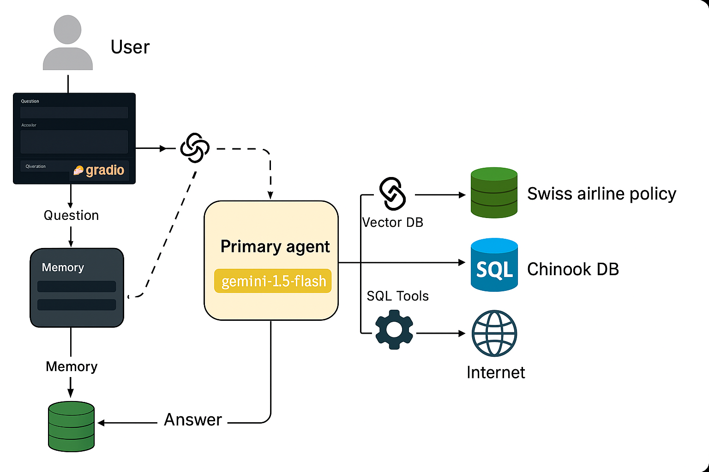

# QueryBot: AI-Powered SQL Agent for Multi-Database Interaction

An AI-powered question-answering agent built with **Gemini 1.5 Flash**, **LangChain**, **LangGraph**, and **LangSmith**, capable of interacting with multiple SQL and vector databases, retrieving real-time web data, and providing conversational memory. This system leverages RAG tools, SQL agents, and a Gradio interface to deliver a seamless natural language interface to data.

---

## 🚀 Features

- **Primary Agent (Gemini 1.5 Flash):** Handles natural language questions and coordinates tools.
- **Gradio UI:** Clean, user-friendly frontend interface for user interactions.
- **Vector DBs:** For context-based retrieval from document-based sources (e.g., airline policy, stories).
- **SQL Agent Tools:** Executes SQL queries on structured databases (e.g., Chinook, airline travel DB).
- **Tavily Search Tool:** Enables up-to-date web search as a fallback.
- **Memory System:** Maintains ongoing conversation context with the user (`Om`).
- **LangChain + LangGraph:** Manages agents, chains, and tool orchestration.
- **LangSmith Integration:** Tracks tool usage, chains, debugging, and session logs.

---


## 🧠 Architecture

- User interacts via **Gradio**.
- Queries go through the **Primary Agent (Gemini 1.5 Flash)**.
- Based on context, the agent routes through:
  - **RAG Tools** (Vector DBs for docs)
  - **SQL Agent** (for SQL databases)
  - **Tavily Search Tool** (for real-time web results)
- All orchestrated via **LangChain + LangGraph**.
- Tracked in **LangSmith**.
- All conversations are saved to memory for context-aware responses.

<div align="center">
  
</div>

---

## 🔧 Setup Instructions

1. **Clone the repo:**

```bash
git clone https://github.com/yourname/querybot.git
cd querybot


pip install -r requirements.txt


OPENAI_API_KEY=your_key
TAVILY_API_KEY=your_key
LANGCHAIN_API_KEY=your_key
LANGSMITH_API_KEY=your_key


python app.py
