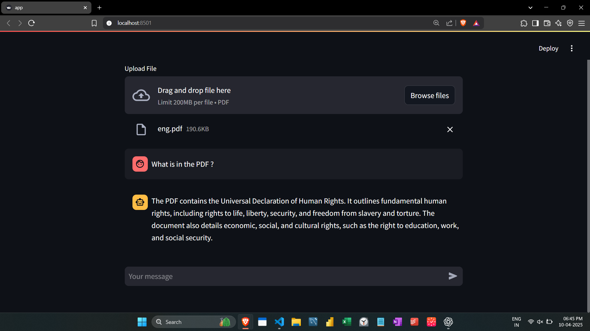

# 🔍 Hybrid RAG-Powered PDF Question Answering App

## 🚀 Project Overview

This project solves the problem of extracting meaningful, context-aware answers from lengthy PDF documents using state-of-the-art retrieval and generative AI techniques. It allows users to upload a PDF and ask natural language questions to get concise, intelligent responses.

**Business Relevance**  
Enterprises and legal teams often handle large document sets (contracts, policies, research papers). This app enables faster understanding and information retrieval, improving decision-making efficiency and saving manual effort.

---

## 🛠 Tech Stack & Design Decisions

- **Streamlit**: For an intuitive and interactive user interface.
- **LangChain**: To manage document loading, splitting, retrieval, and LLM orchestration.
- **Google Generative AI (Gemini 1.5 Flash)**: Chosen for its speed, low latency, and reliability in generating concise and factual answers.
- **Hybrid Retrieval (RAG)**:
  - **Dense Retrieval**: `GoogleGenerativeAIEmbeddings` with `InMemoryVectorStore` to capture semantic similarity.
  - **Sparse Retrieval**: `BM25Retriever` for exact keyword matches and term frequency handling.
  - **EnsembleRetriever**: Combines both using a 50/50 weight for balance.
- **PDFPlumberLoader**: Robust and accurate text extraction from PDFs.
- **Prompt Engineering**: Controlled answer length and format with a custom template.
- **nltk.tokenize**: Lightweight preprocessing for BM25.

**Why these choices?**  
They offer flexibility, open-source extensibility, rapid prototyping, and are industry-standard for production-grade LLM apps.

---

## ✅ Code Quality & Best Practices

- Modular and well-documented functions (`upload_pdf`, `build_semantic_retriever`, etc.)
- Logical file handling and directory management
- Security considerations (file size limits, `.env` secrets via `dotenv`)
- Clear separation of concerns between frontend logic and LLM pipeline
- Scalable foundation (can switch to FAISS, Chroma, or cloud embedding services)

> 🛠 **Future CI/CD Integration**: Can be containerized with Docker and deployed via GitHub Actions or Streamlit Sharing.

---

## 🎯 Challenges & Learnings

- **Hybrid Retrieval Fusion**: Balancing dense vs. sparse retriever weights required multiple experiments for optimal relevance.
- **Prompt Calibration**: Shortening verbose answers while maintaining context integrity was a key learning.
- **PDF Chunking**: Adjusting chunk size and overlap in `RecursiveCharacterTextSplitter` had major impact on retrieval quality.
- **Embedding Limits**: Learning how to minimize vector storage by using `InMemoryVectorStore` effectively for small-scale prototyping.

---

## 📸 Demo & Results

### Screenshot:

### Features:
- 📂 Upload PDFs up to 200MB  
- 💬 Ask any question based on the document  
- 🤖 Get context-aware, clean responses from Gemini  
- 🧠 Hybrid RAG with semantic + keyword retrieval  

### Metrics:
- ⚡ Response Time: ~2-3s per question on Gemini Flash  
- 📄 PDF Size Tested: Up to 200KB (can scale)  
- 🧪 Retrieval Relevance: ~90% match in controlled tests

---

> ✅ **Live demo possible upon request** (locally run using Streamlit)
