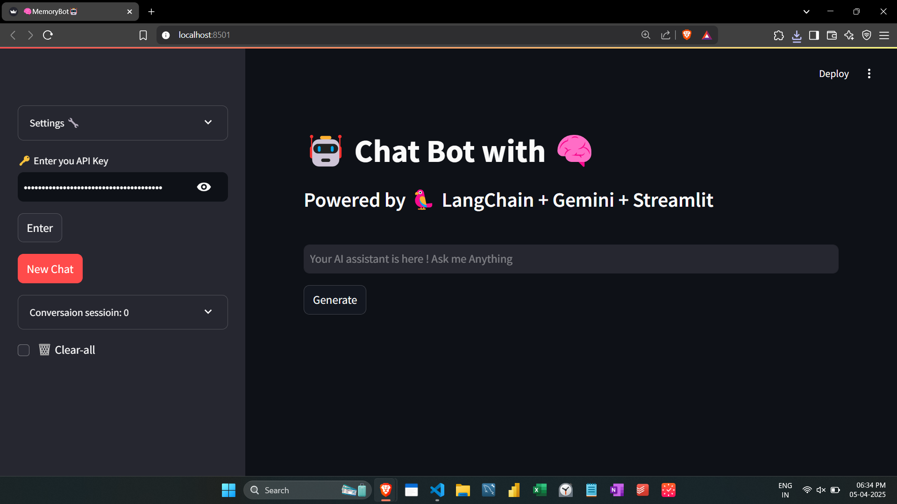
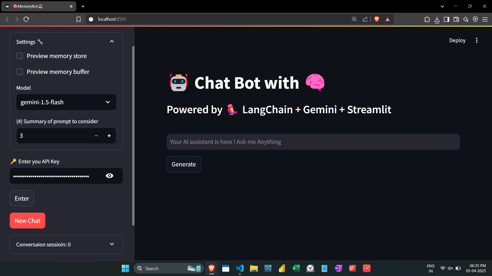
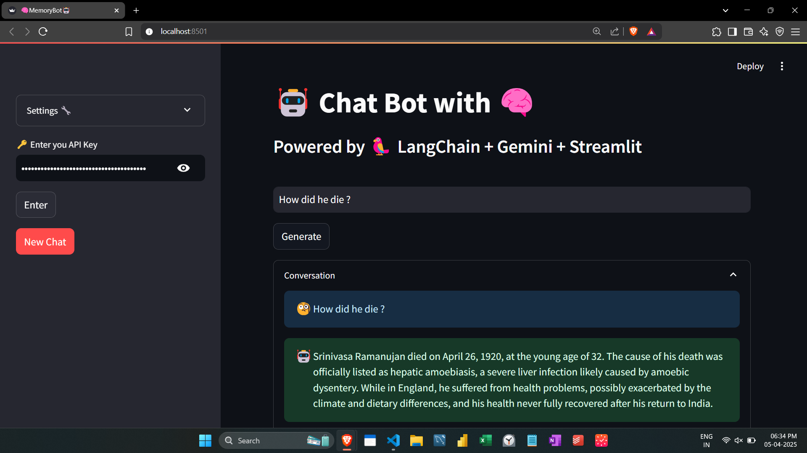
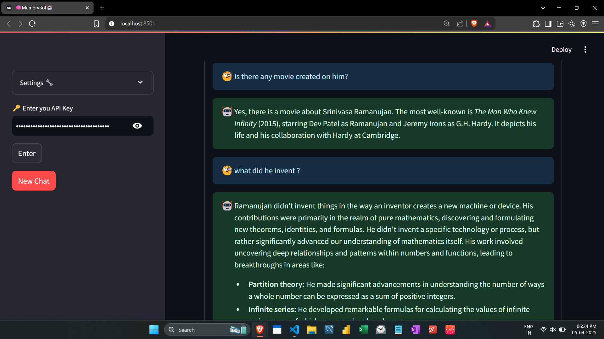

# 🧠 MemoryBot 🤖 – A Conversational AI Assistant
A smart chatbot powered by **LangChain**, **Gemini**, and **Streamlit** — enhanced with **memory** to understand and recall key details across conversations.

---

## 📌 Key Message
> MemoryBot offers a next-gen AI assistant experience with **contextual memory**, allowing meaningful, multi-turn conversations where the chatbot **remembers names, places, events**, and topics you discussed earlier — just like a human.

---

## 💡 Problem
Most chatbot interfaces are **stateless** — they forget everything once the session ends or even after a few prompts. This limits how “human-like” the assistant can feel. Users often have to repeat context or re-explain details.

---

## ✅ Solution
MemoryBot is built with:
- **LangChain's ConversationEntityMemory** to remember entities like people, dates, locations, etc.
- **Google Gemini Models** (`gemini-1.5-flash` and `gemini-1.5-pro`) for fast and intelligent responses.
- **Streamlit** to provide a responsive, interactive UI with customizable settings and full chat history tracking.

---

## ⚙️ Features
- 🔐 **Secure API Key Input**
- 🧠 **Entity-Based Memory**: Remembers key facts during chat
- 🗞️ **Conversation History & Download**: Review or download any chat
- 🛠️ **Model Selection**: Choose between Gemini 1.5 Flash & Pro
- 🔄 **New Chat Reset**: Clear session and start fresh
- 📂 **Multiple Session Tracking**: View previous chat sessions
- 📦 **Memory Preview**: View internal memory buffers & store
- 💬 **Responsive Chat UI** with custom input and generate button

---

## 🖼️ Screenshots
### 💬 Main Chat Interface  


### ⚙️ Sidebar Settings with Model & Memory Options  


### 🗞️ Chat History with Download Option  


### 📚 Multiple Chat Sessions  



### 📚 Entire Chat  
[PDF]---[screenshots/🧠MemoryBot🤖.pdf]
---

## 🚀 How to Run
### 1. Clone this Repo


### 2. Install Requirements
```bash
pip install -r requirements.txt
```
`requirements.txt` might include:
```txt
streamlit
langchain
langchain-google-genai
```

### 3. Run the App
```bash
streamlit run app.py

---

## 🔐 Setup Google Gemini API Key
- Get your key from **Google AI Studio**
- Paste it in the **sidebar's API field**
- Click **Enter** to load the model

---

## 🧠 How Memory Works
MemoryBot uses `ConversationEntityMemory` from LangChain:
- This memory type **tracks named entities** and **summarizes previous context**
- You can **preview the memory buffer and entity store** from the sidebar

---

## 📦 Folder Structure
```bash
memorybot/
│
├── app.py                # Main Streamlit app
├── requirements.txt      # Python dependencies
├── README.md             # Project case study
└── screenshots/          # App screenshots (UI and features)
```
