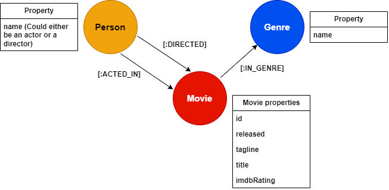

# 🎬 NeoQuery: Knowledge Graph Q&A with Tabular Data

An intelligent chatbot that transforms tabular data into interactive knowledge graphs, enabling natural language querying and RAG-powered information retrieval using **Neo4j**, **Gemini 1.5**, **LangChain**, and **Cypher**.



## 🌟 Overview

NeoQuery bridges the gap between structured tabular data (CSV, XLSX) and conversational AI by constructing knowledge graphs that capture complex relationships within your data. Users can interact with their data using natural language without writing a single line of Cypher or SQL.

## ✨ Key Features

### 🧠 Three Powerful Modes

1. **Q&A with GraphDB (Simple Agent)**
   - Direct natural language to Cypher translation
   - Fast, straightforward query execution
   - Ideal for basic questions

2. **Q&A with GraphDB (Improved Agent)**
   - Advanced entity extraction and mapping
   - Intelligent query validation and correction
   - Context-aware Cypher generation
   - Better handling of ambiguous queries

3. **RAG with GraphDB**
   - Vector similarity search on movie taglines
   - Semantic understanding of user queries
   - Context-enriched responses
   - Perfect for discovery and recommendations

### 🔐 Security-First Design
- **READ-ONLY** database permissions by default
- Scoped access prevents data manipulation
- Safe for production environments
- User queries cannot modify the graph

### 🎯 Knowledge Graph Construction
- Automated graph creation from tabular data
- Support for multiple entity types (Person, Movie, Genre, Location)
- Rich relationship modeling (ACTED_IN, DIRECTED, IN_GENRE)
- LLM-assisted or manual graph building

### 💬 User Experience
- Clean Gradio interface
- Real-time query processing
- Multiple chatbot modes via dropdown
- Feedback system for continuous improvement

## 🏗️ Architecture

```
Tabular Data (CSV/XLSX)
    ↓
Knowledge Graph Construction (Neo4j)
    ↓
User Query (Gradio UI)
    ↓
Agent Selection (Simple/Improved/RAG)
    ↓
┌─────────────────────────────────────┐
│  Simple Agent                       │
│  → Direct Cypher Translation        │
├─────────────────────────────────────┤
│  Improved Agent                     │
│  → Entity Extraction                │
│  → Database Mapping                 │
│  → Query Validation                 │
│  → Cypher Generation                │
├─────────────────────────────────────┤
│  RAG Agent                          │
│  → Query Embedding                  │
│  → Vector Similarity Search         │
│  → Context Retrieval                │
└─────────────────────────────────────┘
    ↓
Natural Language Response
```


## 🚀 Getting Started

### Prerequisites

- Python 3.8+
- Neo4j Desktop or Neo4j AuraDB
- Google Gemini API Key

### Installation

1. **Clone the repository**
```bash
git clone https://github.com/yourusername/NeoQuery-Tabular_Data.git
cd NeoQuery-Tabular_Data
```

2. **Install dependencies**
```bash
pip install -r requirements.txt
```

3. **Set up Neo4j Database**
   - Download and install [Neo4j Desktop](https://neo4j.com/download/)
   - Create a new database with:
     - URI: `bolt://localhost:7687`
     - Username: `neo4j`
     - Password: `Password` (or set your own)

4. **Configure environment variables**

Create a `.env` file in the root directory:
```env
GOOGLE_API_KEY=your_gemini_api_key
```

5. **Prepare your data and build the knowledge graph**

```bash
# Run the data preparation notebook
jupyter notebook notebook/data_preparation.ipynb
```

Or use the provided movie dataset:
```bash
# The movie.csv is already included in data/
# Just run the Cypher queries from data_preparation.ipynb
```

6. **Create vector index for RAG (optional)**

Run this Cypher query in Neo4j Browser:
```cypher
CREATE VECTOR INDEX movie_tagline_embeddings IF NOT EXISTS
FOR (m:Movie)
ON (m.taglineEmbedding)
OPTIONS {indexConfig: {
  `vector.dimensions`: 768,
  `vector.similarity_function`: 'cosine'
}}
```

7. **Launch the application**
```bash
cd src
python app.py
```

The Gradio interface will open at `http://localhost:7860`

## 📁 Project Structure

```
NeoQuery-Tabular_Data/
├── configs/
│   └── app_config.yaml          # LLM and RAG configurations
├── data/
│   └── movie.csv                # Sample movie dataset
├── images/
│   ├── movie_KnowledgeGraph.png # Graph visualization
│   ├── projectschema.png        # Architecture diagram
│   └── UI.png                   # User interface
├── notebook/
│   ├── check_neo4j.ipynb        # Database connectivity check
│   ├── data_preparation.ipynb   # Graph construction
│   └── load_data.ipynb          # Data loading utilities
├── src/
│   ├── utils/
│   │   ├── chatbot.py           # Core chatbot logic
│   │   ├── improved_chain.py    # Advanced agent implementation
│   │   ├── load_config.py       # Configuration loader
│   │   └── ur_settings.py       # UI settings
│   └── app.py                   # Main Gradio application
└── requirements.txt
```

## 🛠️ Configuration

### App Configuration (`configs/app_config.yaml`)

```yaml
llm_config:
  system_message: "You will be given the user question along with the search result..."
  model_name: 'gemini-1.5-flash'
  embedding_model_name: 'models/embedding-001'
  temperature: 0.0

RAG_config:
  top_k: 5  # Number of similar documents to retrieve
```

### Graph Schema

The movie knowledge graph includes:

**Nodes:**
- `Movie`: title, released, imdbRating, tagline
- `Person`: name (actors/directors)
- `Genre`: name
- `Location`: name (filming location)
- `SimilarMovie`: name (similar movie recommendations)

**Relationships:**
- `(Person)-[:ACTED_IN]->(Movie)`
- `(Person)-[:DIRECTED]->(Movie)`
- `(Movie)-[:IN_GENRE]->(Genre)`
- `(Movie)-[:WAS_TAKEN_IN]->(Location)`
- `(Movie)-[:IS_SIMILAR_TO]->(SimilarMovie)`

## 💡 Usage Examples

### Simple Agent Queries
```
User: "Who directed Toy Story?"
Bot: John Lasseter directed Toy Story.

User: "List all movies in the Comedy genre"
Bot: The Comedy movies are Toy Story, Grumpier Old Men, Father of the Bride Part II...
```

### Improved Agent Queries
```
User: "What movies did Tom Hanks act in?"
Bot: [Extracts entity "Tom Hanks" → Maps to database → Generates Cypher]
Response: Tom Hanks acted in Toy Story.

User: "Show me movies from 1995 with high ratings"
Bot: [Extracts year 1995, understands "high ratings" → Generates optimized query]
```

### RAG Queries
```
User: "Find me a movie about adventure and excitement"
Bot: [Embeds query → Searches similar taglines → Returns relevant movies]
Response: Based on your interest in adventure and excitement, I recommend Jumanji with the tagline "Roll the dice and unleash the excitement!"
```

## 🔍 Key Components

### Simple Chain
- Uses `GraphCypherQAChain` from LangChain
- Direct translation of questions to Cypher
- Suitable for straightforward queries

### Improved Chain
- **Entity Extraction**: Identifies people, movies, and years
- **Database Mapping**: Maps extracted entities to actual database values
- **Schema Awareness**: Uses graph schema for accurate query generation
- **Query Correction**: Validates and corrects Cypher syntax
- **Natural Language Response**: Converts query results to conversational format

### RAG Implementation
- **Embedding Generation**: Creates embeddings using Gemini's embedding model
- **Vector Search**: Queries Neo4j vector index for similar content
- **Top-K Retrieval**: Returns most relevant results
- **Context Integration**: Combines search results with system message

## 🎨 Knowledge Graph Construction

### From Tabular Data to Graph

1. **Load your CSV data**
2. **Define your schema** (nodes and relationships)
3. **Run Cypher queries** to create the graph
4. **Verify relationships** in Neo4j Browser

Example Cypher for creating the graph:
```cypher
LOAD CSV WITH HEADERS FROM 'file:///movie.csv' AS row
MERGE (m:Movie {id:row.movieId})
SET m.released = date(row.released),
    m.title = row.title,
    m.tagline = row.tagline,
    m.imdbRating = toFloat(row.imdbRating)

FOREACH (director in split(row.director, '|') |
    MERGE (p:Person {name:trim(director)})
    MERGE (p)-[:DIRECTED]->(m))
```

## 🔒 Security Best Practices

**⚠️ CRITICAL**: Always use READ-ONLY database credentials

```python
# ✅ GOOD: Read-only access
graph = Neo4jGraph(
    url=NEO4J_URI,
    username='readonly_user',
    password='readonly_pass'
)

# ❌ BAD: Write access allows data manipulation
# Users could ask: "Delete all movies from 1995"
```

**Recommended Setup:**
1. Create a read-only user in Neo4j
2. Grant only MATCH and RETURN privileges
3. Test that write operations are blocked
4. Never use admin credentials in production

## 📊 Example Queries by Mode

| Query Type | Simple Agent | Improved Agent | RAG |
|------------|-------------|----------------|-----|
| Direct facts | ✅ Best | ✅ Good | ❌ Not suitable |
| Complex relationships | ⚠️ Limited | ✅ Best | ❌ Not suitable |
| Semantic search | ❌ Not suitable | ❌ Not suitable | ✅ Best |
| Ambiguous entities | ⚠️ May fail | ✅ Best | ⚠️ Limited |
| Discovery/Recommendations | ❌ Not suitable | ⚠️ Limited | ✅ Best |

## 🚧 Limitations & Considerations

1. **LLM Non-Determinism**: Results may vary between runs when using LLMs for graph construction
2. **Cypher Knowledge**: Better questions come from users familiar with graph concepts
3. **Context Window**: Complex queries might exceed LLM context limits
4. **Schema Complexity**: More complex graphs need careful prompt engineering
5. **Vector Index**: RAG mode requires proper vector index setup

## 🤝 Contributing

Contributions are welcome! Areas for improvement:

- [ ] Support for additional data formats (JSON, XML)
- [ ] Multi-hop reasoning in improved agent
- [ ] Automated schema inference from data
- [ ] Query caching for performance
- [ ] Support for multiple graphs
- [ ] Advanced visualization tools

## 📝 License

This project is licensed under the MIT License.

## 🙏 Acknowledgments

- **Neo4j** for the powerful graph database
- **Google Gemini** for advanced language understanding
- **LangChain** for agent orchestration
- **Gradio** for the intuitive interface

## 📧 Contact

For questions, feedback, or collaboration opportunities, please open an issue or reach out via LinkedIn.

