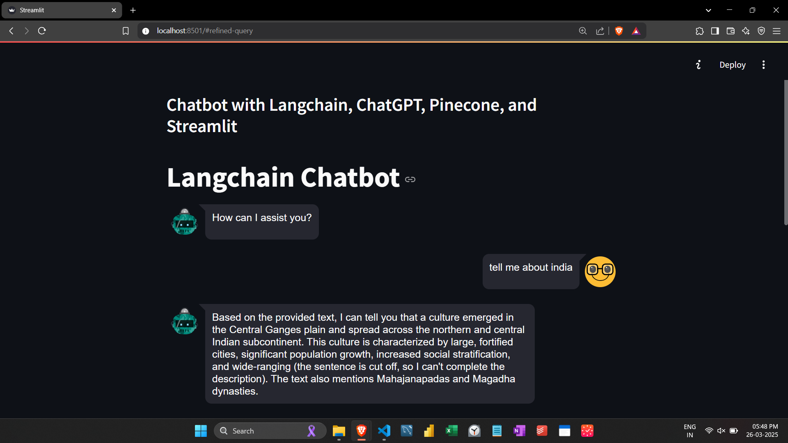
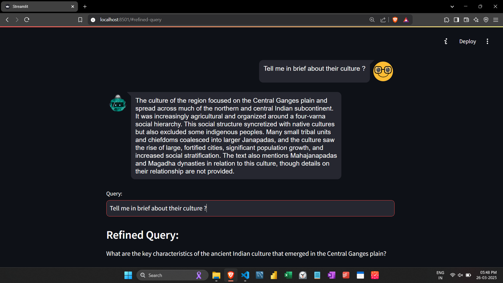

# 🤖 LangChain Chatbot with ChatGPT, Pinecone, and Streamlit

This is a Streamlit-based conversational chatbot application built using LangChain, Google Generative AI (Gemini), and Pinecone for vector search. The chatbot can understand user queries, refine them for better accuracy, and provide context-based answers.

## 🚀 Features
- **Conversational Memory:** Remembers the context of the conversation using LangChain's ConversationBufferWindowMemory.
- **Query Refinement:** Automatically refines user queries for better understanding.
- **Contextual Responses:** Answers questions using the most relevant context retrieved from Pinecone.
- **Streamlit Interface:** Interactive, user-friendly interface with conversation history display.

  

---

  

## 📝 Prerequisites
- Python 3.8 or above
- Streamlit
- Google Generative AI (Gemini) API key
- Pinecone API key (for context search)
- LangChain library
- dotenv for API key management

## 📁 Installation

python -m venv venv
source venv/bin/activate  # On Windows: venv\Scripts\activate

* pip install streamlit streamlit-chat langchain langchain-google-genai google-generativeai python-dotenv pinecone-client

touch .env

* GOOGLE_API_KEY=your-google-api-key-here
* PINECONE_API_KEY=your-pinecone-api-key-here
* PINECONE_ENVIRONMENT=your-pinecone-environment

streamlit run app.py

